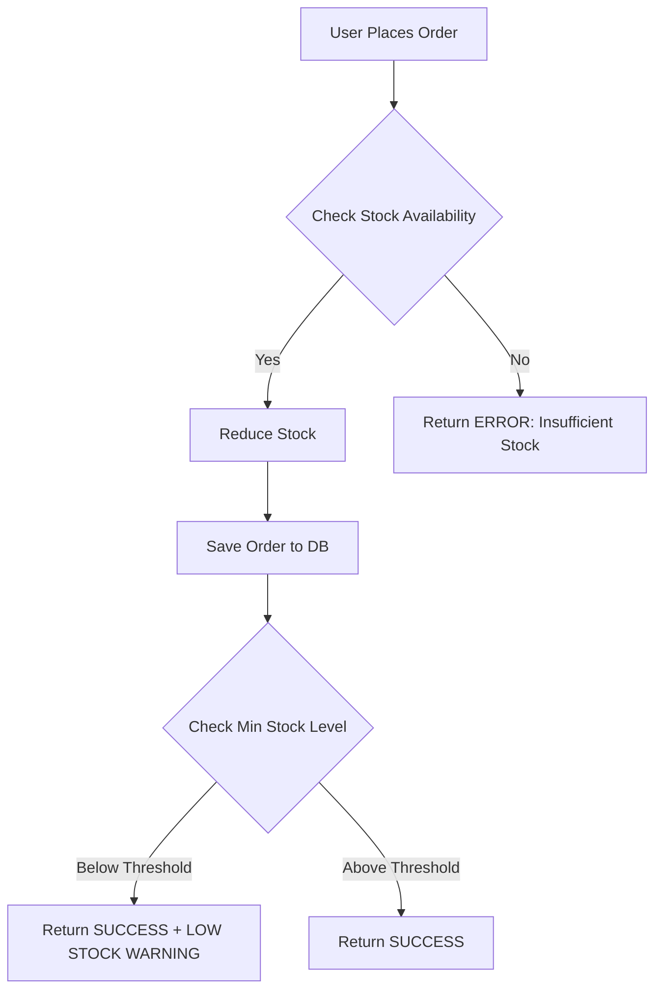

# 🛒 Smart Inventory System

[](https://www.oracle.com/java/)
[](https://spring.io/projects/spring-boot)
[](https://www.mysql.com/)
[](https://maven.apache.org/)

A **production-ready backend system** for managing inventory, processing real-time orders, and generating automated stock alerts using **Spring Boot**, **REST APIs**, and **MySQL**.

---

## ⭐ Overview

Smart Inventory System helps businesses automate product tracking, validate orders before processing, and receive instant alerts when stock reaches low levels.

---

## 🚀 Features

### ✅ Product Management

* Full CRUD operations to add, read, update, and delete products
* Category, price, stock quantity & minimum threshold tracking

### 📦 Order Processing

* **ACID-safe operations** ensuring consistent stock updates
* Rejects orders automatically if stock is insufficient

### ⚠️ Automated Low-Stock Alerts

* Every order triggers a stock re-evaluation
* Returns warnings when stock goes below `minStockLevel`

---

## 🧱 Tech Stack

| Component            | Technology                    | Purpose                      |
| -------------------- | ----------------------------- | ---------------------------- |
| **Backend**          | Java 21 + Spring Boot         | Core application logic       |
| **Database**         | MySQL 8                       | Relational data storage      |
| **ORM**              | Hibernate / JPA               | Entity mapping & SQL queries |
| **API Architecture** | REST                          | Stateless API communication  |
| **Tools**            | Maven, IntelliJ IDEA, Postman | Build & testing              |

---

## 📐 Order Processing Flow



---

## 📁 Project Structure

```
src/main/java/com/inventory/smart_inventory
│
├── controller
│   └── ProductController.java          # Handles API requests
│
├── dto
│   └── OrderRequest.java               # Request validation DTOs
│
├── model
│   ├── Product.java                    # Product entity
│   └── OrderRecord.java                # Order entity
│
├── repository
│   ├── ProductRepository.java
│   └── OrderRepository.java            # DB access layer
│
└── service
    └── ProductService.java             # Business logic layer
```

---

## ⚙️ Setup Instructions

### 1️⃣ Clone the Repository

```bash
git clone https://github.com/Navi-1105/Smart-Inventory.git
cd Smart-Inventory
```

### 2️⃣ Configure Database

Create a database in MySQL:

```sql
CREATE DATABASE inventory_db;
```

Configure the database connection:

```
spring.datasource.url=jdbc:mysql://localhost:3306/inventory_db
spring.datasource.username=root
spring.datasource.password=YOUR_PASSWORD
```

### 3️⃣ Run the Application

Using Maven:

```bash
./mvnw spring-boot:run
```

Or run `SmartInventoryApplication.java` via IntelliJ.

---

## 🧪 API Endpoints

### 📌 Add a Product

**POST** `/api/products`

```json
{
  "name": "Gaming Laptop",
  "category": "Electronics",
  "price": 55000,
  "stockQuantity": 50,
  "minStockLevel": 5
}
```

### 📌 Place an Order

**POST** `/api/order`

```json
{
  "productId": 1,
  "quantity": 2
}
```

**Sample Response:**

```
"Order processed successfully! ⚠️ Warning: Stock is low (3 remaining)."
```

---

## 👩‍💻 Author

**Navneet**
GitHub: [https://github.com/Navi-1105](https://github.com/Navi-1105)

⭐ *If this project helped you, please consider giving it a star!*
